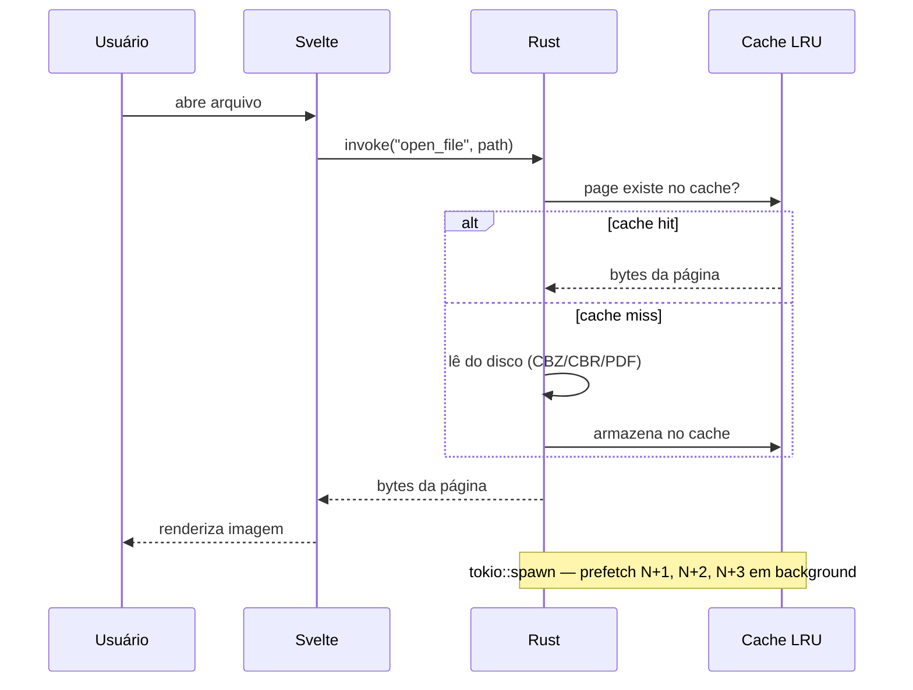
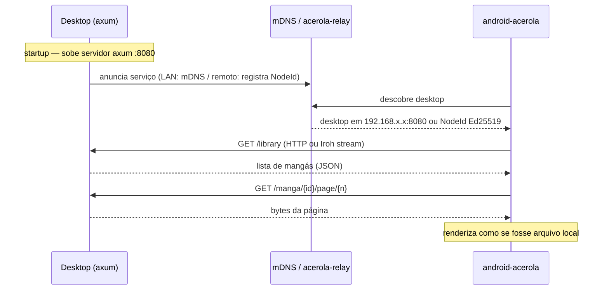
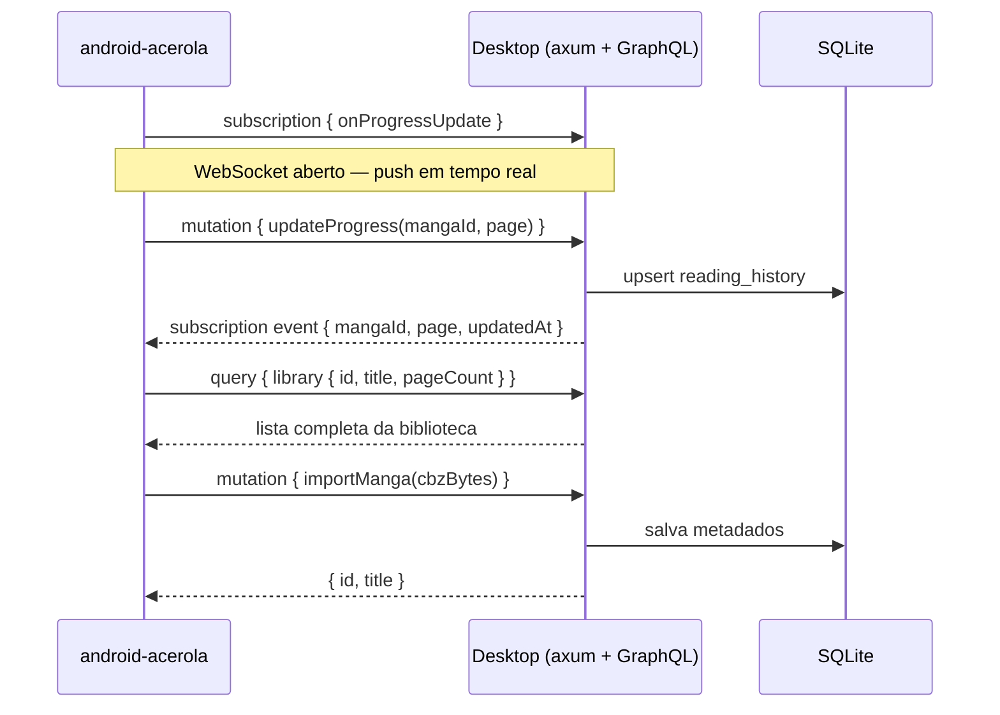
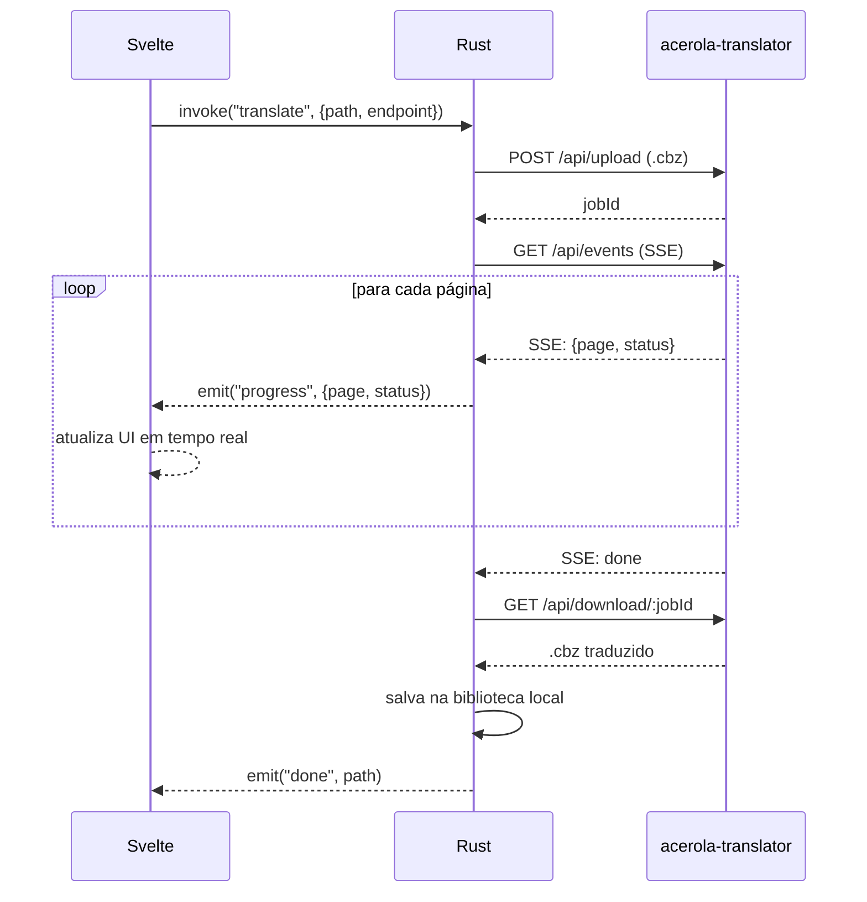

# acerola-desktop

**Documento de Arquitetura e Decisões Técnicas**
_Parte do ecossistema acerola — GPL3_

---

## 1. Visão geral do projeto

O acerola-desktop é o cliente desktop multiplataforma do ecossistema acerola. O usuário abre o app, navega pela biblioteca local de mangás, lê arquivos `.cbz` e `.cbr`, converte `.pdf` para esses formatos, e opcionalmente conecta via plugin ao acerola-translator para tradução automática com IA.

O projeto faz parte de um ecossistema maior:

- `android-acerola` — leitor Android existente (Kotlin, GPL3)
- `acerola-translator` — serviço de tradução com IA (Go + Python, GPL3)
- `acerola-desktop` — este projeto (Rust + Tauri + Svelte, GPL3)
- `acerola-relay` — serviço de coordenação P2P e relay (Rust + Svelte, GPL3)
- `acerola-web-reader` — leitor web futuro (GPL3)

O desktop é um cliente independente — funciona sem o translator. O plugin de tradução é opcional e configurável para apontar para uma instância selfhost ou para o servidor pago do ecossistema acerola.

---

## 2. O problema que o projeto resolve

Dado um arquivo `.cbz`, `.cbr` ou `.pdf` na máquina local do usuário:

- Extrair e renderizar as páginas com performance nativa
- Manter um cache inteligente (LRU por bytes) para navegação fluida
- Gerenciar uma biblioteca local escaneando pastas do sistema
- Converter `.pdf` para `.cbz` preservando qualidade das imagens
- Servir a biblioteca via HTTP local para que o celular conecte e leia (LAN)
- Servir a biblioteca remotamente via Iroh quando fora da LAN (tier pago)
- Conectar ao acerola-translator via plugin para traduzir com IA
- Sincronizar histórico de leitura e progresso com o Android bidirecionalmente
- Funcionar em Linux e Windows com binários assinados

---

## 3. Arquitetura final

| Camada | Tecnologia | Responsabilidade |
|---|---|---|
| Shell nativo | Rust + Tauri v2 | Janela, sistema de arquivos, bridge frontend↔OS |
| Leitura de arquivos | Rust (zip, unrar, pdfium-render) | CBZ, CBR, PDF — extração de páginas |
| Cache | Rust (lru) | LRU por bytes — páginas em memória |
| Servidor local | Rust (axum) | Streaming de páginas via HTTP + GraphQL |
| Conectividade P2P | Rust (iroh) | NAT traversal, QUIC transport, hole punching |
| Descoberta LAN | Rust (mdns-sd) | Descobre devices na rede local (tier gratuito) |
| Sync de dados | GraphQL + WebSocket | Histórico, progresso, biblioteca — bidirecional |
| Hashing de conteúdo | BLAKE3 | Identidade e deduplicação de arquivos CBZ |
| Frontend | Svelte 5 + TypeScript | UI, leitor, biblioteca, configurações |
| Estilo | Tailwind CSS + shadcn-svelte | Componentes e design system |
| Plugin de tradução | HTTP client → acerola-translator | Envia CBZ, recebe progresso SSE, baixa resultado |
| Assinatura de binário | SignPath Foundation | Assinatura gratuita para projetos GPL3 — Windows |

### 3.1 Por que Tauri + Rust e não Wails + Go

O critério decisivo não foi performance nem tamanho de binário — foi **ecossistema e facilidade de pesquisa**. Para um projeto onde o desenvolvedor quer aprender fazendo — pesquisar "como fazer X" e achar um exemplo bom rapidamente — o Tauri entrega isso de forma consistente. O Wails falha nesse ponto em casos menos comuns.

O Rust do desktop é mínimo e contido. Todo o código Rust se resume a: abrir arquivos, gerenciar cache, expor funções ao Svelte via `#[tauri::command]`, e subir o servidor axum. A lógica pesada — OCR, inpainting, tradução — fica no acerola-translator. O borrow checker é o maior obstáculo no início, mas o escopo é pequeno o suficiente para aprender sem frustração excessiva.

O paradigma funcional do Rust também é familiar para quem vem de Kotlin com Arrow-kt — `Result<T, E>`, `Option<T>`, `map`, `and_then`, imutabilidade por padrão. O modelo mental já existe, só a sintaxe muda.

### 3.2 Conectividade — tier gratuito vs tier pago

O acerola-desktop opera em dois modos de conectividade com o Android:

| Tier | Mecanismo | Requisito | Custo |
|---|---|---|---|
| Gratuito | mDNS + HTTP direto na LAN | Desktop e Android na mesma rede | Zero infra |
| Pago | Iroh + acerola-relay | Conta no serviço, qualquer rede | Subscrição mensal |

No tier gratuito, a descoberta é automática via mDNS — o Android encontra o desktop na rede local sem configuração. No tier pago, ambos os apps registram seu NodeId Ed25519 no acerola-relay (coordination server), que serve como ponto de encontro. O Iroh então estabelece conexão QUIC direta via hole punching ou usa o relay como fallback quando o NAT bloqueia a conexão direta.

O relay nunca vê o conteúdo — apenas roteia pacotes QUIC criptografados. O TLS termina nos endpoints (desktop e Android). Trocar entre tier gratuito e pago é mudar uma URL nas configurações.

### 3.3 Sync bidirecional — GraphQL + WebSocket

O axum expõe um endpoint GraphQL (via `async-graphql`) que serve tanto para queries/mutations quanto para subscriptions via WebSocket. O Android consome essa API para sincronizar:

- Histórico de leitura — última página lida por mangá
- Progresso — percentual de conclusão da série
- Biblioteca — lista de mangás disponíveis no desktop
- Downloads — transferência de CBZ do desktop para o Android
- Importações — envio de CBZ do Android para a biblioteca do desktop

GraphQL Subscriptions via WebSocket substituem webhooks — o Android assina eventos e recebe push em tempo real sem polling. O histórico é persistido em SQLite no desktop via `sqlx` com SQL puro e migrations `.sql` versionadas.

### 3.4 Fluxo de dados — leitor local



### 3.5 Fluxo de dados — streaming para celular



### 3.6 Fluxo de dados — sync bidirecional



### 3.7 Fluxo de dados — plugin de tradução



---

## 4. Tradeoffs analisados

### 4.1 Framework desktop

| Opção | Prós | Contras | Veredicto |
|---|---|---|---|
| Tauri v2 | Melhor docs, Rust robusto, binário ~10MB, Svelte nativo | Rust tem curva de aprendizado | ✅ Escolhido |
| Wails + Go | Go simples, compartilha stack com translator | Ecossistema menor, exemplos escassos | ❌ Docs insuficientes para o fluxo de pesquisa desejado |
| Electron | Enorme ecossistema Node | Binário ~150MB, RAM alta | ❌ Pesado demais para leitor de mangá |
| Flutter Desktop | Bons componentes, null safety | Dart é linguagem extra sem benefício claro | ❌ Stack desnecessariamente diferente |

### 4.2 Leitura de arquivos

| Opção | Prós | Contras | Veredicto |
|---|---|---|---|
| zip (crate) | Puro Rust, rápido, sem dependência nativa | Só ZIP — CBZ é ZIP, funciona perfeitamente | ✅ Escolhido para CBZ |
| unrar (crate) | Lê RAR nativamente | Wrapper de lib C — requer libunrar | ✅ Escolhido para CBR |
| pdfium-render | Renderiza PDF com alta fidelidade, mantido pelo Google | Binário nativo pdfium incluído (~30MB) | ✅ Escolhido para PDF |
| pdf-extract | Puro Rust | Qualidade de renderização inferior para imagens | ❌ Descartado |

### 4.3 Conectividade remota

| Opção | Prós | Contras | Veredicto |
|---|---|---|---|
| Iroh (P2P QUIC) | NAT traversal, hole punching, E2E encryption, selfhostável | API ainda muda entre versões | ✅ Escolhido — só como transporte |
| Tailscale/WireGuard | Maduro, amplamente usado | VPN genérica, não focada no caso de uso | ❌ Descartado |
| HTTPS direto | Simples | Requer IP público no desktop — inviável para usuário comum | ❌ Descartado |
| WebRTC | Hole punching nativo browsers | Complexo fora de browsers, overhead alto | ❌ Descartado |

### 4.4 Sync e API

| Opção | Prós | Contras | Veredicto |
|---|---|---|---|
| GraphQL + Subscriptions WS | Query tipada, push em tempo real, um endpoint | Curva inicial maior que REST | ✅ Escolhido |
| REST + Webhooks | Simples, conhecido | Webhook requer IP acessível no Android — inviável | ❌ Descartado |
| gRPC | Eficiente, tipado | Suporte Android mais complexo, overkill para escopo | ❌ Descartado |
| iroh-docs (CRDT) | Sync automático sem conflito | Imaturo, breaking changes frequentes | ❌ Descartado |

### 4.5 Persistência local

| Opção | Prós | Contras | Veredicto |
|---|---|---|---|
| sqlx + SQLite + SQL puro | Sem ORM, controle total, migrations .sql versionadas | Mais verboso que ORM | ✅ Escolhido |
| SeaORM + SQLite | Type-safe, ergonômico | Boilerplate alto para um dev, abstração desnecessária | ❌ Descartado |
| serde_json + arquivos | Zero dependência | Sem queries, sem transações, escala mal | ❌ Descartado para histórico |

### 4.6 Cache de páginas

| Opção | Prós | Contras | Veredicto |
|---|---|---|---|
| lru (crate) por bytes | LRU por tamanho real — evita estourar RAM com páginas grandes | Implementação ligeiramente mais complexa | ✅ Escolhido |
| lru por quantidade | Simples | Página 4K ocupa muito mais que página pequena — limite impreciso | ❌ Descartado |
| Sem cache | Zero complexidade | Leitor trava a cada troca de página | ❌ Inaceitável |

### 4.7 Servidor local para streaming

| Opção | Prós | Contras | Veredicto |
|---|---|---|---|
| axum | Async nativo Rust, tokio, ergonômico, bem documentado | Nenhuma desvantagem relevante | ✅ Escolhido |
| tiny-http | Minimalista | Síncrono — bloqueia em leituras grandes | ❌ Descartado |
| warp | Async, bom ecossistema | axum tem docs melhores e é mais mantido atualmente | ❌ Preterido |

### 4.8 Assinatura de binário

| Opção | Plataforma | Custo | Veredicto |
|---|---|---|---|
| SignPath Foundation | Windows | Gratuito para projetos GPL3 open source | ✅ Escolhido para Windows |
| Apple Developer Program | macOS | $99/ano — sem alternativa gratuita | ⏸️ Adiado — macOS não é prioridade inicial |
| Certum Open Source | Windows | ~$50-80/ano | ❌ Preterido — SignPath é gratuito |
| EV Certificate | Windows | $300-500/ano | ❌ Caro demais para projeto indie |
| Sem assinatura | Linux | Gratuito — AppImage/Flatpak não exige | ✅ Linux não precisa |

O SignPath Foundation assina binários Windows gratuitamente para projetos com licença OSI-aprovada sem dual-licensing comercial. O acerola-desktop é GPL3 puro e se qualifica. O modelo de negócio — cobrar pela hospedagem do servidor — não conflita com os termos porque o binário assinado é 100% open source. O servidor pago é infraestrutura separada, não código dentro do binário.

---

## 5. Estrutura do projeto

```
acerola-desktop/
├── src-tauri/
│   ├── src/
│   │   ├── main.rs                  ← entrypoint Tauri
│   │   ├── commands/                ← funções expostas ao Svelte
│   │   │   ├── library.rs           ← escaneia pasta, lista mangás
│   │   │   ├── reader.rs            ← abre arquivo, retorna página
│   │   │   ├── converter.rs         ← PDF → CBZ
│   │   │   ├── translator.rs        ← plugin: upload, SSE, download
│   │   │   └── sync.rs              ← registro NodeId, status conexão
│   │   ├── archive/
│   │   │   ├── cbz.rs               ← lê ZIP (CBZ)
│   │   │   ├── cbr.rs               ← lê RAR (CBR)
│   │   │   └── pdf.rs               ← renderiza PDF via pdfium-render
│   │   ├── cache/
│   │   │   └── page_cache.rs        ← LRU por bytes, prefetch
│   │   ├── server/
│   │   │   ├── routes.rs            ← axum: /library, /graphql, /page
│   │   │   ├── graphql.rs           ← schema GraphQL + subscriptions
│   │   │   └── mdns.rs              ← anuncia serviço na rede local
│   │   ├── db/
│   │   │   ├── migrations/          ← arquivos .sql versionados
│   │   │   └── history.rs           ← queries de histórico e progresso
│   │   └── state.rs                 ← AppState compartilhado entre commands
│   ├── Cargo.toml
│   └── tauri.conf.json
├── src/
│   ├── lib/
│   │   ├── Reader.svelte            ← leitor de páginas
│   │   ├── Library.svelte           ← grade de mangás
│   │   ├── Progress.svelte          ← progresso de tradução (SSE)
│   │   └── Settings.svelte          ← endpoint translator + relay config
│   ├── App.svelte
│   └── app.css
├── package.json
└── vite.config.ts
```

---

## 6. Decisões de design que não são óbvias

### 6.1 Cache LRU por bytes, não por quantidade

Uma página de mangá pode variar de 200KB a 8MB dependendo da resolução e formato. Um cache de "50 páginas" pode consumir 400MB ou 4GB — impossível prever. O cache por bytes define um limite real (ex: 200MB) e despeja as páginas menos recentes quando o limite é atingido, independente de quantas páginas isso representa.

### 6.2 Prefetch das próximas páginas

Quando o usuário está na página N, o Rust já carrega N+1, N+2, N+3 em background via `tokio::spawn`. O usuário nunca espera — a próxima página já está no cache quando ele vira. Esse padrão transforma um leitor "aceitável" em um leitor que parece nativo.

```rust
#[tauri::command]
async fn prefetch_pages(path: String, current: usize, state: State<'_, AppState>) {
    for i in 1..=3 {
        let path = path.clone();
        let state = state.inner().clone();
        tokio::spawn(async move {
            // carrega em paralelo sem bloquear a UI
        });
    }
}
```

### 6.3 axum como servidor interno completo

O servidor axum não serve só para o celular conectar — é a interface completa de comunicação com o Android. Expõe GraphQL para sync de dados, WebSocket para subscriptions em tempo real, endpoints REST para streaming de páginas, e SSE para progresso de operações longas como conversão de PDF. Tudo no mesmo processo, sem IPC externo.

### 6.4 Iroh só como transporte, axum acima

O Iroh resolve uma coisa: conectar dois dispositivos que não estão na mesma rede, atravessando NAT sem configuração manual. O protocolo de aplicação — GraphQL, streaming de páginas, tudo — continua rodando sobre axum. O Iroh entrega um stream QUIC; o axum faz HTTP sobre esse stream. Isso isola o projeto das partes imaturas do ecossistema Iroh (`iroh-docs`, `iroh-blobs`) e preserva toda a lógica de rotas já planejada.

### 6.5 BLAKE3 para identidade de conteúdo

Cada CBZ tem um hash BLAKE3 calculado na importação. Esse hash é usado para deduplicação na biblioteca, verificação de integridade na transferência para o Android, e como identificador estável mesmo se o arquivo for renomeado. O Iroh já usa BLAKE3 internamente — não é dependência extra.

### 6.6 GraphQL Subscriptions no lugar de webhooks

Webhooks exigem que o Android tenha um endpoint HTTP acessível — inviável em redes móveis. GraphQL Subscriptions via WebSocket invertem a direção: o Android abre uma conexão persistente com o desktop e recebe eventos push (novo mangá importado, tradução concluída, progresso de leitura alterado em outro dispositivo) sem polling e sem precisar de IP público.

### 6.7 Plugin de tradução e relay são só configuração de URL

Nenhum dos dois plugins tem lógica de provedor — armazenam apenas uma URL base. Selfhost do translator aponta para `localhost:8080`, servidor pago aponta para `api.acerola.app`. Relay gratuito usa mDNS sem configuração, relay pago aponta para `relay.acerola.app`. O protocolo é idêntico nos dois casos. Trocar é mudar uma string nas configurações.

### 6.8 SQL puro + sqlx, sem ORM

SeaORM e outros ORMs adicionam uma camada de abstração que oculta o SQL gerado e reduz o controle sobre índices, transações e queries complexas. Para um desenvolvedor que sabe SQL, migrations `.sql` versionadas com `sqlx` oferecem mais transparência e portabilidade. O schema é legível diretamente, sem mapeamento mental extra.

### 6.9 SignPath Foundation — GPL3 como vantagem

A licença GPL3 que poderia parecer limitante para o modelo de negócio é exatamente o que qualifica o projeto para assinatura gratuita no Windows. O modelo correto é: software open source, serviço pago. Nextcloud, Jellyfin e Immich operam da mesma forma.

---

## 7. Ordem de implementação recomendada

| Fase | O que implementar | O que aprende |
|---|---|---|
| 1 | Tauri hello world — janela abre, Svelte renderiza | Setup Tauri, estrutura de projeto, bridge Rust↔Svelte |
| 2 | Abrir CBZ, listar páginas no frontend via comando Tauri | crate zip, `#[tauri::command]`, Svelte 5 runes básico |
| 3 | Renderizar páginas no leitor — navegação básica | Transferência de bytes Rust→Svelte, exibição de imagem |
| 4 | Cache LRU por bytes + prefetch das próximas páginas | crate lru, `tokio::spawn`, AppState com Mutex |
| 5 | Abrir CBR | crate unrar, lidar com formato binário diferente |
| 6 | Converter PDF → CBZ | pdfium-render, pipeline de conversão, progresso via SSE |
| 7 | Biblioteca local + SQLite para histórico | walkdir, sqlx, migrations .sql, queries de progresso |
| 8 | Servidor axum + GraphQL + mDNS — celular conecta na LAN | axum, async-graphql, mdns-sd, subscriptions WS |
| 9 | Sync bidirecional Android↔desktop via GraphQL | Schema GraphQL, resolvers, histórico, downloads |
| 10 | Plugin de tradução — upload, SSE, download | reqwest, SSE client, configuração de endpoint |
| 11 | Integração Iroh — NodeId, registro no relay, conexão remota | iroh Endpoint, QUIC transport, keypair Ed25519 |
| 12 | UI completa com shadcn-svelte + Tailwind | Svelte 5 runes avançado, design system |
| 13 | SignPath Foundation — configurar assinatura Windows | CI/CD, GitHub Actions, code signing pipeline |

---

## 8. Visão do ecossistema acerola

O desktop foi desenhado para ser um nó do ecossistema, não um app isolado. Ele consome e serve ao mesmo tempo:

- `GET /library` — lista os mangás da biblioteca local
- `GET /manga/{id}/page/{n}` — serve uma página para qualquer cliente na rede
- `/graphql` — queries, mutations e subscriptions para sync com Android
- `POST /api/upload` → acerola-translator — envia para tradução
- `GET /api/events` → acerola-translator — recebe progresso em tempo real

| Projeto | Linguagem | Consome o desktop? | Consome o translator? |
|---|---|---|---|
| android-acerola | Kotlin | Sim — GraphQL + streaming HTTP/Iroh | Sim — plugin HTTP |
| acerola-desktop | Rust + Tauri + Svelte | É o servidor local | Sim — plugin HTTP |
| acerola-translator | Go + Python | Não | É o serviço |
| acerola-relay | Rust + Svelte | Coordination layer | Não |
| acerola-web-reader | A definir | Sim — mesmo endpoint GraphQL | Sim — mesmo plugin |

### 8.1 acerola-relay — novo projeto do ecossistema

O acerola-relay é o serviço de infraestrutura que viabiliza o tier pago. É composto por duas peças independentes:

**Coordination server (Rust + axum + PostgreSQL)**

- Gerencia contas de usuário e autenticação JWT
- Persiste NodeIds Ed25519 dos dispositivos registrados
- Expõe API REST: `/auth`, `/devices` — CRUD simples
- Serve como ponto de encontro: Android e desktop trocam NodeIds via API antes de qualquer conexão Iroh

```sql
-- schema mínimo
users   (id, email, password_hash, tier)
devices (id, user_id, node_id, name, last_seen)
```

**iroh-relay (binário n0-computer)**

- Stateless — não persiste nada, apenas roteia pacotes QUIC em memória
- Fallback quando hole punch falha por NAT simétrico
- Nunca vê o conteúdo — TLS termina nos endpoints
- Rodado como processo separado atrás do nginx

```
nginx (TLS termination)
├── /api  →  coordination server (axum)
└── /relay →  iroh-relay (binário n0)
```

Stack do acerola-relay: Rust + axum (coordination API) + PostgreSQL (usuários/devices) + Svelte 5 (dashboard admin e usuário) + iroh-relay binário. Segue a mesma stack do desktop — reaproveita o conhecimento sem linguagem extra.

### 8.2 Modelo de negócio

O software é 100% open source (GPL3). A monetização é via hospedagem:

- **Selfhost** — usuário sobe o `acerola-translator` e o `acerola-relay` na própria máquina, configura os endpoints no desktop e no Android, usa sem custo
- **Servidor pago** — usuário paga mensalidade e aponta os endpoints para `api.acerola.app` e `relay.acerola.app`

O binário assinado pelo SignPath Foundation é o mesmo nos dois cenários — apenas as URLs mudam. O custo de infra do relay é baixo: o `iroh-relay` é stateless e o custo dominante é largura de banda de sinalização QUIC, não armazenamento. A maioria das conexões estabelece hole punch direto e o tráfego não passa pelo relay.

Modelo análogo ao Tailscale (coordination server + relay para WireGuard P2P), Nextcloud e Jellyfin — open source com serviço gerenciado como produto.

### 8.3 Evolução futura

Se o Rust clicar bem no acerola-desktop e no acerola-relay, o acerola-translator pode ser portado de Go para Rust — reduzindo o ecossistema de 4 linguagens (Rust, Go, Python, TypeScript) para 3 (Rust, Python, TypeScript). O Python permanece por conta do manga-ocr, que não tem alternativa equivalente fora do ecossistema Python de ML.

---

_acerola-desktop — documento gerado a partir de sessão de arquitetura_
_Licença GPL3 — parte do ecossistema acerola_
