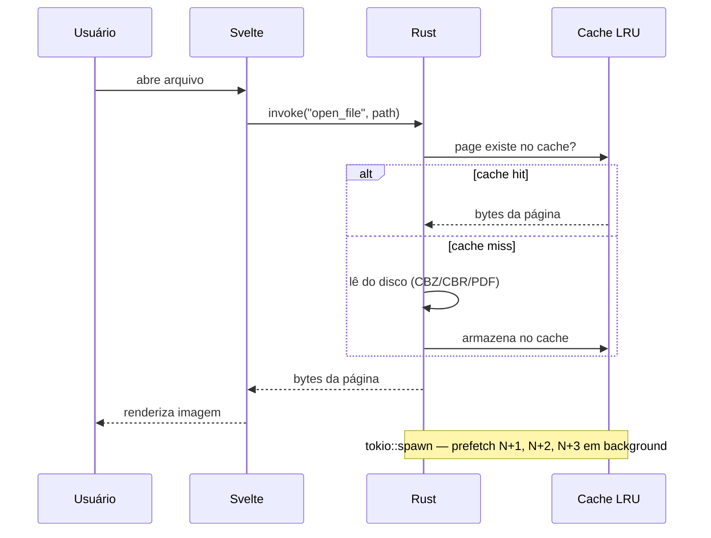
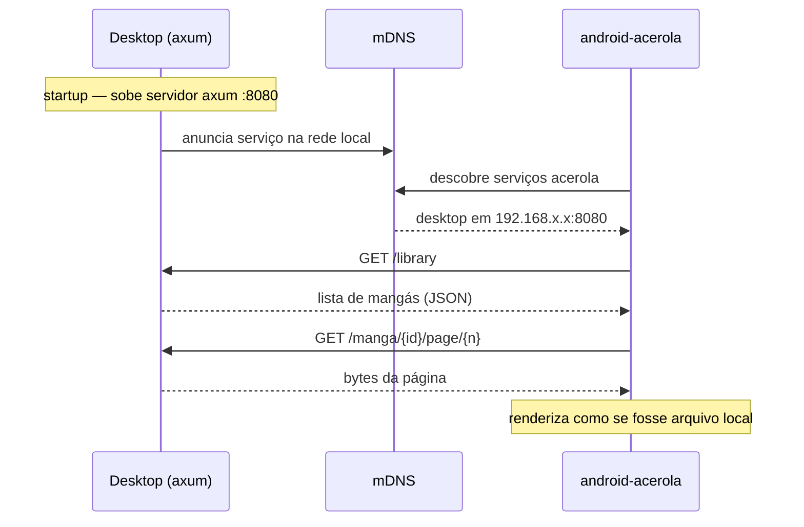
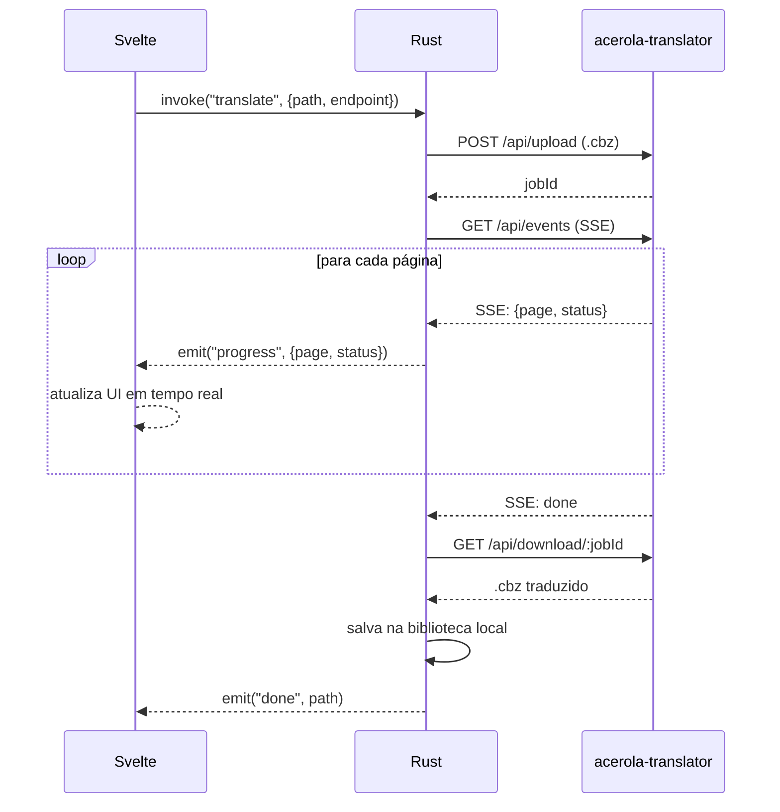

# acerola-desktop

**Documento de Arquitetura e Decisões Técnicas**
_Parte do ecossistema acerola — GPL3_

---

## 1. Visão geral do projeto

O acerola-desktop é o cliente desktop multiplataforma do ecossistema acerola. O usuário abre o app, navega pela biblioteca local de mangás, lê arquivos `.cbz` e `.cbr`, converte `.pdf` para esses formatos, e opcionalmente conecta via plugin ao acerola-translator para tradução automática com IA.

O projeto faz parte de um ecossistema maior:

- `android-acerola` — leitor Android existente (Kotlin, GPL3)
- `acerola-translator` — serviço de tradução com IA (Go + Python, GPL3)
- `acerola-desktop` — este projeto (Rust + Tauri + Svelte, GPL3)
- `acerola-web-reader` — leitor web futuro (GPL3)

O desktop é um cliente independente — funciona sem o translator. O plugin de tradução é opcional e configurável para apontar para uma instância selfhost ou para o servidor pago do ecossistema acerola.

---

## 2. O problema que o projeto resolve

Dado um arquivo `.cbz`, `.cbr` ou `.pdf` na máquina local do usuário:

- Extrair e renderizar as páginas com performance nativa
- Manter um cache inteligente (LRU por bytes) para navegação fluida
- Gerenciar uma biblioteca local escaneando pastas do sistema
- Converter `.pdf` para `.cbz` preservando qualidade das imagens
- Servir a biblioteca via HTTP local para que o celular conecte e leia
- Conectar ao acerola-translator via plugin para traduzir com IA
- Funcionar em Linux e Windows com binários assinados

---

## 3. Arquitetura final

| Camada | Tecnologia | Responsabilidade |
|---|---|---|
| Shell nativo | Rust + Tauri v2 | Janela, sistema de arquivos, bridge frontend↔OS |
| Leitura de arquivos | Rust (zip, unrar, pdfium-render) | CBZ, CBR, PDF — extração de páginas |
| Cache | Rust (lru) | LRU por bytes — páginas em memória |
| Servidor local | Rust (axum) | Streaming de páginas via HTTP para celular |
| Descoberta de rede | Rust (mdns-sd) | Descobre translator e celular na rede local |
| Frontend | Svelte 5 + TypeScript | UI, leitor, biblioteca, configurações |
| Estilo | Tailwind CSS + shadcn-svelte | Componentes e design system |
| Plugin de tradução | HTTP client → acerola-translator | Envia CBZ, recebe progresso SSE, baixa resultado |
| Assinatura de binário | SignPath Foundation | Assinatura gratuita para projetos GPL3 — Windows |

### 3.1 Por que Tauri + Rust e não Wails + Go

O critério decisivo não foi performance nem tamanho de binário — foi **ecossistema e facilidade de pesquisa**. Para um projeto onde o desenvolvedor quer aprender fazendo — pesquisar "como fazer X" e achar um exemplo bom rapidamente — o Tauri entrega isso de forma consistente. O Wails falha nesse ponto em casos menos comuns.

O Rust do desktop é mínimo e contido. Todo o código Rust se resume a: abrir arquivos, gerenciar cache, expor funções ao Svelte via `#[tauri::command]`, e subir o servidor axum. A lógica pesada — OCR, inpainting, tradução — fica no acerola-translator. O borrow checker é o maior obstáculo no início, mas o escopo é pequeno o suficiente para aprender sem frustração excessiva.

O paradigma funcional do Rust também é familiar para quem vem de Kotlin com Arrow-kt — `Result<T, E>`, `Option<T>`, `map`, `and_then`, imutabilidade por padrão. O modelo mental já existe, só a sintaxe muda.

### 3.2 Fluxo de dados — leitor local



### 3.3 Fluxo de dados — streaming para celular



### 3.4 Fluxo de dados — plugin de tradução



---

## 4. Tradeoffs analisados

### 4.1 Framework desktop

| Opção | Prós | Contras | Veredicto |
|---|---|---|---|
| Tauri v2 | Melhor docs, Rust robusto, binário ~10MB, Svelte nativo | Rust tem curva de aprendizado | ✅ Escolhido |
| Wails + Go | Go simples, compartilha stack com translator | Ecossistema menor, exemplos escassos | ❌ Docs insuficientes para o fluxo de pesquisa desejado |
| Electron | Enorme ecossistema Node | Binário ~150MB, RAM alta | ❌ Pesado demais para leitor de mangá |
| Flutter Desktop | Bons componentes, null safety | Dart é linguagem extra sem benefício claro | ❌ Stack desnecessariamente diferente |

### 4.2 Leitura de arquivos

| Opção | Prós | Contras | Veredicto |
|---|---|---|---|
| zip (crate) | Puro Rust, rápido, sem dependência nativa | Só ZIP — CBZ é ZIP, funciona perfeitamente | ✅ Escolhido para CBZ |
| unrar (crate) | Lê RAR nativamente | Wrapper de lib C — requer libunrar | ✅ Escolhido para CBR |
| pdfium-render | Renderiza PDF com alta fidelidade, mantido pelo Google | Binário nativo pdfium incluído (~30MB) | ✅ Escolhido para PDF |
| pdf-extract | Puro Rust | Qualidade de renderização inferior para imagens | ❌ Descartado |

### 4.3 Cache de páginas

| Opção | Prós | Contras | Veredicto |
|---|---|---|---|
| lru (crate) por bytes | LRU por tamanho real — evita estourar RAM com páginas grandes | Implementação ligeiramente mais complexa | ✅ Escolhido |
| lru por quantidade | Simples | Página 4K ocupa muito mais que página pequena — limite impreciso | ❌ Descartado |
| Sem cache | Zero complexidade | Leitor trava a cada troca de página | ❌ Inaceitável |

### 4.4 Servidor local para streaming

| Opção | Prós | Contras | Veredicto |
|---|---|---|---|
| axum | Async nativo Rust, tokio, ergonômico, bem documentado | Nenhuma desvantagem relevante | ✅ Escolhido |
| tiny-http | Minimalista | Síncrono — bloqueia em leituras grandes | ❌ Descartado |
| warp | Async, bom ecossistema | axum tem docs melhores e é mais mantido atualmente | ❌ Preterido |

### 4.5 Assinatura de binário

| Opção | Plataforma | Custo | Veredicto |
|---|---|---|---|
| SignPath Foundation | Windows | Gratuito para projetos GPL3 open source | ✅ Escolhido para Windows |
| Apple Developer Program | macOS | $99/ano — sem alternativa gratuita | ⏸️ Adiado — macOS não é prioridade inicial |
| Certum Open Source | Windows | ~$50-80/ano | ❌ Preterido — SignPath é gratuito |
| EV Certificate | Windows | $300-500/ano | ❌ Caro demais para projeto indie |
| Sem assinatura | Linux | Gratuito — AppImage/Flatpak não exige | ✅ Linux não precisa |

O SignPath Foundation assina binários Windows gratuitamente para projetos com licença OSI-aprovada sem dual-licensing comercial. O acerola-desktop é GPL3 puro e se qualifica. O modelo de negócio — cobrar pela hospedagem do servidor — não conflita com os termos porque o binário assinado é 100% open source. O servidor pago é infraestrutura separada, não código dentro do binário.

### 4.6 Interface de usuário

| Opção | Prós | Contras | Veredicto |
|---|---|---|---|
| Svelte 5 + Tailwind + shadcn-svelte | Svelte é o mais simples para UI customizada, Tailwind acelera estilo, shadcn-svelte tem componentes modernos customizáveis | Svelte 5 runes é sintaxe nova | ✅ Escolhido |
| React + shadcn/ui | Enorme ecossistema | Verboso, boilerplate excessivo para uma pessoa | ❌ Descartado |
| Vue 3 | Menos verboso que React | Menor ecossistema de componentes que shadcn-svelte | ❌ Descartado |

---

## 5. Estrutura do projeto

```
acerola-desktop/
├── src-tauri/
│   ├── src/
│   │   ├── main.rs                  ← entrypoint Tauri
│   │   ├── commands/                ← funções expostas ao Svelte
│   │   │   ├── library.rs           ← escaneia pasta, lista mangás
│   │   │   ├── reader.rs            ← abre arquivo, retorna página
│   │   │   ├── converter.rs         ← PDF → CBZ
│   │   │   └── translator.rs        ← plugin: upload, SSE, download
│   │   ├── archive/
│   │   │   ├── cbz.rs               ← lê ZIP (CBZ)
│   │   │   ├── cbr.rs               ← lê RAR (CBR)
│   │   │   └── pdf.rs               ← renderiza PDF via pdfium-render
│   │   ├── cache/
│   │   │   └── page_cache.rs        ← LRU por bytes, prefetch
│   │   ├── server/
│   │   │   ├── routes.rs            ← axum: /library, /manga/:id/page/:n
│   │   │   └── mdns.rs              ← anuncia serviço na rede local
│   │   └── state.rs                 ← AppState compartilhado entre commands
│   ├── Cargo.toml
│   └── tauri.conf.json
├── src/
│   ├── lib/
│   │   ├── Reader.svelte            ← leitor de páginas
│   │   ├── Library.svelte           ← grade de mangás
│   │   ├── Progress.svelte          ← progresso de tradução (SSE)
│   │   └── Settings.svelte          ← endpoint do translator
│   ├── App.svelte
│   └── app.css
├── package.json
└── vite.config.ts
```

---

## 6. Decisões de design que não são óbvias

### 6.1 Cache LRU por bytes, não por quantidade

Uma página de mangá pode variar de 200KB a 8MB dependendo da resolução e formato. Um cache de "50 páginas" pode consumir 400MB ou 4GB — impossível prever. O cache por bytes define um limite real (ex: 200MB) e despeja as páginas menos recentes quando o limite é atingido, independente de quantas páginas isso representa.

### 6.2 Prefetch das próximas páginas

Quando o usuário está na página N, o Rust já carrega N+1, N+2, N+3 em background via `tokio::spawn`. O usuário nunca espera — a próxima página já está no cache quando ele vira. Esse padrão transforma um leitor "aceitável" em um leitor que parece nativo.

```rust
#[tauri::command]
async fn prefetch_pages(path: String, current: usize, state: State<'_, AppState>) {
    for i in 1..=3 {
        let path = path.clone();
        let state = state.inner().clone();
        tokio::spawn(async move {
            // carrega em paralelo sem bloquear a UI
        });
    }
}
```

### 6.3 axum como servidor interno, não só para streaming

O servidor axum não serve só para o celular conectar — ele também é a interface para operações pesadas que não cabem bem em comandos Tauri síncronos. Conversões de PDF longas retornam progresso via SSE pelo mesmo servidor, sem travar a UI.

### 6.4 Plugin de tradução é só configuração de URL

O plugin não tem lógica de provedor — ele armazena apenas uma URL base. Selfhost aponta para `localhost:8080`, servidor pago aponta para `api.acerola.app`. O protocolo é idêntico nos dois casos. Trocar de um para o outro é mudar uma string nas configurações.

### 6.5 Rust no Tauri é mínimo e contido

Todo o Rust escrito no desktop se resume a abrir arquivos, gerenciar cache, expor funções via `#[tauri::command]`, e subir o servidor axum. A lógica pesada fica no acerola-translator. O escopo pequeno torna o borrow checker gerenciável para quem está aprendendo.

### 6.6 SignPath Foundation — GPL3 como vantagem

A licença GPL3 que poderia parecer limitante para o modelo de negócio é exatamente o que qualifica o projeto para assinatura gratuita no Windows. O modelo correto é: software open source, serviço pago. Nextcloud, Jellyfin e Immich operam da mesma forma.

---

## 7. Ordem de implementação recomendada

| Fase | O que implementar | O que aprende |
|---|---|---|
| 1 | Tauri hello world — janela abre, Svelte renderiza | Setup Tauri, estrutura de projeto, bridge Rust↔Svelte |
| 2 | Abrir CBZ, listar páginas no frontend via comando Tauri | crate zip, `#[tauri::command]`, Svelte 5 runes básico |
| 3 | Renderizar páginas no leitor — navegação básica | Transferência de bytes Rust→Svelte, exibição de imagem |
| 4 | Cache LRU por bytes + prefetch das próximas páginas | crate lru, `tokio::spawn`, AppState com Mutex |
| 5 | Abrir CBR | crate unrar, lidar com formato binário diferente |
| 6 | Converter PDF → CBZ | pdfium-render, pipeline de conversão, progresso via SSE |
| 7 | Biblioteca local — escanear pasta, persistir metadados | walkdir, serde + serde_json, fs nativo |
| 8 | Servidor axum + mDNS — celular conecta e lê | axum, tokio, mdns-sd, streaming HTTP |
| 9 | Plugin de tradução — upload, SSE, download | reqwest, SSE client, configuração de endpoint |
| 10 | UI completa com shadcn-svelte + Tailwind | Svelte 5 runes avançado, design system |
| 11 | SignPath Foundation — configurar assinatura Windows | CI/CD, GitHub Actions, code signing pipeline |

---

## 8. Visão do ecossistema acerola

O desktop foi desenhado para ser um nó do ecossistema, não um app isolado. Ele consome e serve ao mesmo tempo:

- `GET /library` — lista os mangás da biblioteca local
- `GET /manga/{id}/page/{n}` — serve uma página para qualquer cliente na rede
- `POST /api/upload` → acerola-translator — envia para tradução
- `GET /api/events` → acerola-translator — recebe progresso em tempo real

| Projeto | Linguagem | Consome o desktop? | Consome o translator? |
|---|---|---|---|
| android-acerola | Kotlin | Sim — streaming HTTP local | Sim — plugin HTTP |
| acerola-desktop | Rust + Tauri + Svelte | É o servidor local | Sim — plugin HTTP |
| acerola-translator | Go + Python | Não | É o serviço |
| acerola-web-reader | A definir | Sim — mesmo endpoint | Sim — mesmo plugin |

### 8.1 Modelo de negócio

O software é 100% open source (GPL3). A monetização é via hospedagem:

- **Selfhost** — usuário sobe o acerola-translator na própria máquina, configura o endpoint no desktop e no Android, usa sem custo
- **Servidor pago** — usuário paga mensalidade e aponta o endpoint para `api.acerola.app` nos dois apps

O binário assinado pelo SignPath Foundation é o mesmo nos dois cenários — apenas a URL muda.

### 8.2 Evolução futura

Se o Rust clicar bem no acerola-desktop, o acerola-translator pode ser portado de Go para Rust — reduzindo o ecossistema de 4 linguagens (Rust, Go, Python, TypeScript) para 3 (Rust, Python, TypeScript). O Python permanece por conta do manga-ocr, que não tem alternativa equivalente fora do ecossistema Python de ML.

---

_acerola-desktop — documento gerado a partir de sessão de arquitetura_
_Licença GPL3 — parte do ecossistema acerola_
